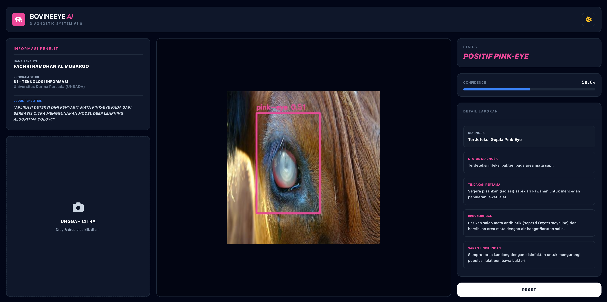

# 🐄 BovineEye AI 

> **APLIKASI DETEKSI DINI PENYAKIT MATA PINK-EYE PADA SAPI BERBASIS CITRA MENGGUNAKAN MODEL DEEP LEARNING ALGORITMA YOLOv4**
>
> Peneliti: **Fachri Ramdhan Al Mubaroq** · S1 Teknologi Informasi · Universitas Darma Persada (UNSADA)
> Repository Skripsi: http://repository.unsada.ac.id/5030/



---

## Table of Contents

1. [Project Overview](#1-project-overview)
2. [Problem Statement & Objectives](#2-problem-statement--objectives)
3. [System Architecture](#3-system-architecture)
4. [Tech Stack](#4-tech-stack)
5. [Directory Structure](#5-directory-structure)
6. [Prerequisites & Installation](#6-prerequisites--installation)
7. [Configuration](#7-configuration)
8. [Running the Application](#8-running-the-application)
9. [API Reference](#9-api-reference)
10. [Frontend Components](#10-frontend-components)
11. [AI / ML Pipeline](#11-ai--ml-pipeline)
12. [Detection Logic & Classification Rules](#12-detection-logic--classification-rules)
13. [Deployment (Railway)](#13-deployment-railway)
14. [Environment Variables](#14-environment-variables)
15. [Known Limitations & Future Work](#15-known-limitations--future-work)
16. [License & Citation](#16-license--citation)

---

## 1. Project Overview

**BovineEye AI** adalah aplikasi web diagnostik berbasis kecerdasan buatan yang membantu peternak sapi mendeteksi penyakit *Infectious Bovine Keratoconjunctivitis* (IBK), yang umum dikenal sebagai **Pink Eye**, secara mandiri melalui foto digital mata sapi.

Sistem ini mengintegrasikan model *object detection* **YOLOv4** yang di-host di platform **Roboflow** dengan backend **Flask** dan antarmuka pengguna berbasis **Tailwind CSS**. Pengguna cukup mengunggah satu foto, dan sistem akan secara otomatis menganalisis, menggambar *bounding box* pada area yang terdeteksi, serta memberikan saran medis praktis.

### Highlights

| Fitur | Keterangan |
|---|---|
| Deep Scan Analysis | Inferensi berbasis YOLOv4 via Roboflow Cloud API |
| Visual Bounding Box | Hijau = Sehat, Ungu/Pink = Positif Pink Eye |
| Medical Recommendations | Saran tindakan: isolasi, pengobatan, pencegahan |
| Dual Theme UI | Dark Mode & Light Mode dengan toggle persisten |
| Dynamic UX | Hasil ditampilkan tanpa reload halaman (Fetch API) |
| Cloud Ready | Siap deploy ke Railway dengan konfigurasi PORT otomatis |

---

## 2. Problem Statement & Objectives

### Latar Belakang

Penyakit *Pink Eye* (IBK) adalah salah satu penyakit mata yang paling umum dan merugikan pada sapi. Penyakit ini disebabkan oleh bakteri *Moraxella bovis* dan disebarkan melalui lalat serta kontak langsung antar hewan. Jika tidak segera ditangani, dapat menyebabkan kebutaan permanen dan kerugian ekonomi yang signifikan bagi peternak.

Tantangan utama di lapangan adalah keterbatasan akses peternak ke tenaga dokter hewan, terutama di daerah terpencil. Deteksi visual secara manual pun memerlukan keahlian khusus.

### Tujuan Penelitian

1. Membangun model *object detection* berbasis YOLOv4 yang mampu membedakan kondisi mata sapi **Sehat** dan **Pink Eye**.
2. Mengembangkan aplikasi web yang dapat menjalankan inferensi model tersebut secara *real-time*.
3. Menyediakan antarmuka yang mudah digunakan oleh pengguna non-teknis (peternak).

---

## 3. System Architecture

```
┌─────────────────────────────────────────────────────────────────┐
│                         CLIENT BROWSER                          │
│                                                                 │
│  [Drag & Drop / Upload Image]  →  [Fetch API POST /detect]      │
│                          ↑                                      │
│          [Render Result Image + Medical Report Card]            │
└──────────────────────────┬──────────────────────────────────────┘
                           │ HTTP POST (multipart/form-data)
                           ▼
┌─────────────────────────────────────────────────────────────────┐
│                       FLASK BACKEND (app.py)                    │
│                                                                 │
│  1. Receive image → save to static/results/ (UUID filename)     │
│  2. Send image path → Roboflow InferenceHTTPClient              │
│  3. Receive predictions (class, confidence, bbox coords)        │
│  4. OpenCV: draw bounding boxes onto image                      │
│  5. Determine status: POSITIF / NEGATIF                         │
│  6. Compose info_list (structured medical advice)               │
│  7. Save annotated image → static/results/                      │
│  8. Return JSON response                                        │
└──────────────────────────┬──────────────────────────────────────┘
                           │ HTTPS (inference-sdk)
                           ▼
┌─────────────────────────────────────────────────────────────────┐
│               ROBOFLOW CLOUD API (detect.roboflow.com)          │
│                                                                 │
│  Model: deteksi-sapi/8  (YOLOv4)                                │
│  Returns: predictions[] with class, confidence, x, y, w, h     │
└─────────────────────────────────────────────────────────────────┘
```

### Data Flow (Step-by-Step)

1. **Upload** — Pengguna memilih atau *drag & drop* foto mata sapi ke dropzone.
2. **Transfer** — JavaScript mengemas file ke `FormData` dan mengirim `POST /detect`.
3. **Save Input** — Backend menyimpan file dengan nama acak (`UUID`) ke `static/results/in_<uuid>.jpg`.
4. **Cloud Inference** — File path dikirim ke Roboflow API; model YOLOv4 memproses gambar di cloud.
5. **Annotation** — OpenCV membaca gambar lokal, menggambar *bounding box* dan label teks.
6. **Classification** — Backend menentukan status berdasarkan nama kelas prediksi.
7. **Save Output** — Gambar teranotasi disimpan sebagai `static/results/res_<uuid>.jpg`.
8. **Response** — Backend mengembalikan JSON berisi URL gambar, status, confidence, dan saran.
9. **Render** — Frontend memperbarui tampilan secara dinamis tanpa reload halaman.

---

## 4. Tech Stack

### Backend & AI Engine

| Komponen | Versi | Peran |
|---|---|---|
| Python | 3.10+ | Bahasa utama |
| Flask | Latest | Micro web framework |
| inference-sdk | Latest | Client Roboflow Cloud API |
| OpenCV (`cv2`) | Latest | Anotasi bounding box pada citra |
| YOLOv4 (via Roboflow) | Model v8 | Object detection inti |
| uuid | stdlib | Penamaan file unik |
| os | stdlib | Manajemen path & direktori |

### Frontend (Client Side)

| Komponen | Versi | Peran |
|---|---|---|
| HTML5 | — | Struktur antarmuka |
| Tailwind CSS | CDN (v3) | Styling utility-first |
| Font Awesome | 6.4.2 | Ikon sistem |
| JavaScript (Vanilla) | ES6+ | Interaktivitas & Fetch API |

### Infrastructure

| Komponen | Keterangan |
|---|---|
| Railway | Platform hosting / deployment |
| Roboflow | Manajemen dataset & cloud inference |

---

## 5. Directory Structure

```
bovineeye-ai/
│
├── app.py                  # Entry point — Flask application & API routes
│
├── templates/
│   └── index.html          # Single-page UI (Jinja2 template)
│
├── static/
│   └── results/            # Auto-created; stores uploaded & annotated images
│       ├── in_<uuid>.jpg   # Original uploaded image
│       └── res_<uuid>.jpg  # Annotated result image
│
├── requirements.txt        # Python dependencies (recommended)
├── README.md               # Project overview
└── screenshoot.png         # UI screenshot for README
```

> **Catatan:** Folder `static/results/` dibuat secara otomatis oleh `app.py` saat pertama kali dijalankan. Tidak perlu dibuat manual.

---

## 6. Prerequisites & Installation

### Persyaratan Sistem

- Python **3.10** atau lebih baru
- pip (Python package manager)
- Koneksi internet aktif (untuk Roboflow Cloud API)
- Browser modern (Chrome, Firefox, Edge)

### Langkah Instalasi

**1. Clone repository**

```bash
git clone https://github.com/<username>/bovineeye-ai.git
cd bovineeye-ai
```

**2. (Opsional) Buat virtual environment**

```bash
python -m venv venv

# Aktivasi di Windows:
venv\Scripts\activate

# Aktivasi di macOS/Linux:
source venv/bin/activate
```

**3. Install semua dependensi**

```bash
pip install flask inference-sdk opencv-python numpy
```

Atau jika tersedia `requirements.txt`:

```bash
pip install -r requirements.txt
```

**4. Pastikan struktur folder sudah benar**

```bash
mkdir -p static/results templates
```

File `index.html` harus berada di dalam folder `templates/`.

**5. Jalankan aplikasi**

```bash
python app.py
```

Aplikasi akan berjalan di: `http://127.0.0.1:5000`

---

## 7. Configuration

Semua konfigurasi kritis berada di bagian atas `app.py`:

```python
# ========================== KONFIGURASI ROBOFLOW SDK ==========================
CLIENT = InferenceHTTPClient(
    api_url="https://detect.roboflow.com",
    api_key="YOUR_ROBOFLOW_API_KEY"       # Ganti dengan API Key Anda
)
MODEL_ID = "deteksi-sapi/8"              # Format: <project-slug>/<version>

UPLOAD_FOLDER = 'static/results'         # Direktori penyimpanan gambar
```

### Parameter Konfigurasi

| Parameter | Default | Keterangan |
|---|---|---|
| `api_url` | `https://detect.roboflow.com` | Endpoint Roboflow Cloud Inference |
| `api_key` | *(wajib diisi)* | API Key dari akun Roboflow Anda |
| `MODEL_ID` | `deteksi-sapi/8` | Project slug dan versi model YOLOv4 |
| `UPLOAD_FOLDER` | `static/results` | Path penyimpanan gambar input & output |
| `PORT` | `5000` | Port server; dibaca dari ENV `PORT` untuk Railway |

> ⚠️ **Keamanan:** Jangan commit API Key ke repository publik. Gunakan environment variable (lihat [bagian 14](#14-environment-variables)).

---

## 8. Running the Application

### Development (Lokal)

```bash
python app.py
```

Output terminal yang diharapkan:

```
 * Running on http://0.0.0.0:5000
 * Debug mode: off
```

### Production (Railway)

Railway secara otomatis mengisi variabel `PORT`. Kode sudah mengakomodasi ini:

```python
port = int(os.environ.get("PORT", 5000))
app.run(host='0.0.0.0', port=port)
```

Tidak perlu konfigurasi tambahan untuk deployment di Railway.

---

## 9. API Reference

### `GET /`

Menampilkan halaman utama aplikasi.

**Response:** HTML page (`index.html`)

---

### `POST /detect`

Menerima gambar mata sapi dan mengembalikan hasil deteksi.

**Request**

| Property | Value |
|---|---|
| Method | `POST` |
| Content-Type | `multipart/form-data` |
| Body Field | `image` (file) — format JPEG, PNG, dll. |

**Contoh Request (JavaScript)**

```javascript
const formData = new FormData();
formData.append("image", fileInput.files[0]);

const response = await fetch("/detect", {
  method: "POST",
  body: formData,
});
const data = await response.json();
```

**Response — Sukses (HTTP 200)**

```json
{
  "image_url": "static/results/res_<uuid>.jpg",
  "status": "POSITIF PINK-EYE",
  "confidence": "87.3%",
  "stadium": "Terdeteksi Gejala Pink Eye",
  "info_tambahan": [
    {
      "label": "Status Diagnosa",
      "text": "Terdeteksi infeksi bakteri pada area mata sapi."
    },
    {
      "label": "Tindakan Pertama",
      "text": "Segera pisahkan (isolasi) sapi dari kawanan untuk mencegah penularan lewat lalat."
    },
    {
      "label": "Penyembuhan",
      "text": "Berikan salep mata antibiotik (seperti Oxytetracycline) dan bersihkan area mata dengan air hangat/larutan salin."
    },
    {
      "label": "Saran Lingkungan",
      "text": "Semprot area kandang dengan disinfektan untuk mengurangi populasi lalat pembawa bakteri."
    }
  ]
}
```

**Response — Kondisi Sehat (HTTP 200)**

```json
{
  "image_url": "static/results/res_<uuid>.jpg",
  "status": "NEGATIF / SEHAT",
  "confidence": "94.1%",
  "stadium": "Kondisi Mata Normal",
  "info_tambahan": [
    {
      "label": "Status Diagnosa",
      "text": "Tidak ditemukan tanda-tanda infeksi bakteri Pink Eye."
    },
    ...
  ]
}
```

**Response — Error (HTTP 400 / 500)**

```json
{
  "error": "File tidak ditemukan"
}
```

```json
{
  "error": "<pesan error dari server>"
}
```

### Response Field Reference

| Field | Tipe | Keterangan |
|---|---|---|
| `image_url` | `string` | Path relatif ke gambar hasil anotasi |
| `status` | `string` | `"POSITIF PINK-EYE"` atau `"NEGATIF / SEHAT"` |
| `confidence` | `string` | Nilai confidence tertinggi dari semua prediksi, format `"xx.x%"` |
| `stadium` | `string` | Deskripsi singkat diagnosa |
| `info_tambahan` | `array of object` | List saran medis/pencegahan, masing-masing berisi `label` dan `text` |

---

## 10. Frontend Components

Seluruh UI berada dalam satu file `templates/index.html` tanpa framework JavaScript tambahan.

### Layout Grid

```
┌──────────────────── HEADER (panel-card) ────────────────────────┐
│  Logo + Judul Aplikasi                   [Toggle Dark/Light]     │
└─────────────────────────────────────────────────────────────────┘

┌─── SIDEBAR KIRI ───┬──── AREA UTAMA (Gambar) ────┬─SIDEBAR KANAN─┐
│ Informasi Peneliti  │                             │  Status         │
│                     │   [Gambar / Placeholder]    │  Confidence Bar │
│ [Dropzone Upload]   │   [Scanner Animation]       │  Detail Laporan │
│                     │   [Loading Spinner]         │                 │
│                     │                             │  [Reset Button] │
└─────────────────────┴─────────────────────────────┴─────────────────┘
```

*(Pada mobile, grid beralih ke layout 1 kolom penuh)*

### Komponen Utama

| ID Elemen | Fungsi |
|---|---|
| `#dropzone` | Area klik & drag-and-drop untuk upload gambar |
| `#fileInput` | Input file tersembunyi, dipicu oleh klik dropzone |
| `#resImage` | Tag `` untuk menampilkan gambar hasil anotasi |
| `#placeholderText` | Ikon "Standby" yang tersembunyi setelah upload |
| `#loading` | Overlay spinner selama proses inferensi |
| `#scanner` | Animasi garis scan saat loading |
| `#detStatus` | Teks status POSITIF / NEGATIF |
| `#detConf` | Nilai persentase confidence |
| `#confBar` | Progress bar confidence (transisi CSS) |
| `#recList` | Container untuk kartu-kartu saran medis |
| `#sidePanel` | Panel kanan; diaktifkan setelah hasil diterima |
| `#theme-toggle` | Tombol switch Dark / Light Mode |

### Theme System

Dark/Light mode diimplementasikan menggunakan Tailwind CSS `darkMode: "class"`. Preferensi pengguna disimpan di `localStorage` dengan key `color-theme`.

```javascript
// Membaca preferensi tersimpan saat halaman dimuat
if (localStorage.getItem("color-theme") === "dark" || ...) {
    document.documentElement.classList.add("dark");
}

// Toggle saat tombol ditekan
document.documentElement.classList.toggle("dark");
localStorage.setItem("color-theme", isDark ? "dark" : "light");
```

### CSS Custom Classes

| Class | Keterangan |
|---|---|
| `.panel-card` | Card container utama dengan border radius dan border |
| `.custom-scroll` | Scrollbar tipis & halus untuk panel konten |
| `.scan-effect` | Animasi garis scan (keyframe `scan-line`) |

---

## 11. AI / ML Pipeline

### Model

| Properti | Detail |
|---|---|
| Arsitektur | YOLOv4 (*You Only Look Once* v4) |
| Platform | Roboflow Cloud Inference |
| Model ID | `deteksi-sapi/8` |
| Task | Object Detection |
| Input | Gambar JPEG/PNG (resolusi bebas) |
| Output | Array prediksi berisi kelas, confidence, dan koordinat bbox |

### Alur Inferensi di Backend

```python
# 1. Kirim gambar ke Roboflow
result = CLIENT.infer(input_path, model_id=MODEL_ID)
predictions = result.get('predictions', [])

# 2. Iterasi setiap prediksi
for pred in predictions:
    label = pred['class'].lower()      # Nama kelas (misal: "sehat", "pink eye")
    conf  = pred['confidence']          # Nilai 0.0 – 1.0
    
    # Konversi koordinat dari format center (x,y,w,h) ke format corner (x1,y1)
    x = int(pred['x'] - pred['width'] / 2)
    y = int(pred['y'] - pred['height'] / 2)
    w = int(pred['width'])
    h = int(pred['height'])
    
    # 3. Gambar bounding box dengan OpenCV
    color = (153, 72, 236) if "sehat" not in label else (0, 255, 0)
    cv2.rectangle(image, (x, y), (x + w, y + h), color, 3)
    cv2.putText(image, f"{label} {conf:.2f}", (x, y - 10), ...)
```

### Format Koordinat Roboflow

Roboflow mengembalikan koordinat dalam format **center-based**:

| Field | Keterangan |
|---|---|
| `x` | Koordinat X titik tengah bounding box |
| `y` | Koordinat Y titik tengah bounding box |
| `width` | Lebar bounding box |
| `height` | Tinggi bounding box |

Backend mengonversi ke format **top-left corner** yang dibutuhkan OpenCV menggunakan:
```
x1 = x - (width / 2)
y1 = y - (height / 2)
```

---

## 12. Detection Logic & Classification Rules

### Logika Penentuan Status

```python
is_positive = False
max_score   = 0

for pred in predictions:
    label = pred['class'].lower()
    conf  = pred['confidence']
    
    if conf > max_score:
        max_score = conf              # Ambil confidence tertinggi
    
    if "sehat" not in label:
        is_positive = True            # Jika ada kelas selain "sehat", tandai positif
```

### Aturan Klasifikasi

| Kondisi | Status | Warna Bbox |
|---|---|---|
| Semua prediksi mengandung kata `"sehat"` | `NEGATIF / SEHAT` | Hijau `(0, 255, 0)` |
| Minimal satu prediksi **tidak** mengandung `"sehat"` | `POSITIF PINK-EYE` | Ungu `(153, 72, 236)` |
| Tidak ada prediksi sama sekali | `NEGATIF / SEHAT` | *(tidak ada bbox)* |

> **Catatan:** Logika deteksi bergantung pada nama kelas di dataset Roboflow. Jika nama kelas untuk kondisi normal bukan `"sehat"`, konstanta ini perlu disesuaikan di `app.py`.

### Tabel Saran Medis

**Jika POSITIF:**

| Label | Isi Saran |
|---|---|
| Status Diagnosa | Terdeteksi infeksi bakteri pada area mata sapi |
| Tindakan Pertama | Isolasi sapi dari kawanan untuk mencegah penularan |
| Penyembuhan | Salep antibiotik (Oxytetracycline) + bersihkan dengan air hangat |
| Saran Lingkungan | Disinfeksi kandang, kurangi populasi lalat |

**Jika NEGATIF:**

| Label | Isi Saran |
|---|---|
| Status Diagnosa | Tidak ditemukan tanda infeksi Pink Eye |
| Tindakan Pencegahan | Jaga sanitasi kandang secara rutin |
| Nutrisi Sapi | Pastikan asupan Vitamin A tercukupi |
| Monitoring | Pengecekan berkala, terutama musim kemarau |

---

## 13. Deployment (Railway)

### Persiapan File

Pastikan file berikut tersedia sebelum deploy:

**`Procfile`** (buat jika belum ada):
```
web: python app.py
```

**`requirements.txt`** (buat jika belum ada):
```
flask
inference-sdk
opencv-python-headless
numpy
```

> Gunakan `opencv-python-headless` (bukan `opencv-python`) di server produksi karena tidak memerlukan GUI dependencies.

### Langkah Deploy ke Railway

1. Buat akun di [railway.app](https://railway.app)
2. Klik **New Project** → **Deploy from GitHub repo**
3. Pilih repository ini
4. Railway akan otomatis mendeteksi Python dan menjalankan `pip install -r requirements.txt`
5. Set environment variable `ROBOFLOW_API_KEY` di dashboard Railway (lihat bagian 14)
6. Klik **Deploy** — aplikasi akan online dalam beberapa menit

---

## 14. Environment Variables

Untuk keamanan, disarankan memindahkan API Key dari hardcode ke environment variable:

**Ubah `app.py` menjadi:**

```python
import os

CLIENT = InferenceHTTPClient(
    api_url="https://detect.roboflow.com",
    api_key=os.environ.get("ROBOFLOW_API_KEY", "fallback_key_for_local")
)
```

**Set di Railway Dashboard:**

| Variable | Value |
|---|---|
| `ROBOFLOW_API_KEY` | API Key dari akun Roboflow Anda |
| `PORT` | (otomatis diisi Railway) |

**Set di lokal (opsional):**

```bash
# Linux/macOS
export ROBOFLOW_API_KEY="your_api_key_here"

# Windows CMD
set ROBOFLOW_API_KEY=your_api_key_here
```

---

## 15. Known Limitations & Future Work

### Keterbatasan Saat Ini

| Limitasi | Keterangan |
|---|---|
| Akurasi bergantung kualitas foto | Foto buram, sudut ekstrem, atau pencahayaan buruk dapat menurunkan akurasi deteksi |
| Tidak ada autentikasi pengguna | Aplikasi bersifat publik tanpa sistem login |
| Gambar tidak dihapus otomatis | File di `static/results/` terus bertambah; perlu mekanisme pembersihan berkala |
| Satu model, dua kelas | Model hanya membedakan Sehat dan Pink Eye; tidak mendeteksi penyakit mata sapi lainnya |
| Ketergantungan koneksi internet | Inferensi dilakukan di cloud Roboflow; tidak bisa offline |

### Pengembangan Lebih Lanjut (Future Work)

- [ ] Tambah autentikasi pengguna (login peternak)
- [ ] Riwayat deteksi per pengguna (database SQLite/PostgreSQL)
- [ ] Dukungan input video / kamera langsung (real-time)
- [ ] Notifikasi otomatis (email/SMS) jika terdeteksi positif
- [ ] Offline mode dengan model TFLite di perangkat mobile
- [ ] Ekspansi kelas penyakit (Pinkeye stadium 1-3, Uveitis, dll.)
- [ ] Auto-cleanup file hasil deteksi setelah N hari
- [ ] Laporan PDF per sesi deteksi

---

## 16. License & Citation

### Penggunaan Akademik

Proyek ini dikembangkan sebagai bagian dari penelitian skripsi S1. Jika Anda menggunakan atau mereferensikan proyek ini dalam karya akademik, mohon sertakan kutipan berikut:

```
Al Mubaroq, Fachri Ramdhan. (2024). Aplikasi Deteksi Dini Penyakit Mata Pink-Eye 
pada Sapi Berbasis Citra Menggunakan Model Deep Learning Algoritma YOLOv4. 
Skripsi, S1 Teknologi Informasi, Universitas Darma Persada (UNSADA).
http://repository.unsada.ac.id/5030/
```

### Teknologi Pihak Ketiga

Proyek ini menggunakan library dan platform open-source / berlisensi berikut:

- [Flask](https://flask.palletsprojects.com/) — BSD License
- [OpenCV](https://opencv.org/) — Apache 2.0 License
- [Roboflow](https://roboflow.com/) — Commercial (Cloud API)
- [Tailwind CSS](https://tailwindcss.com/) — MIT License
- [Font Awesome](https://fontawesome.com/) — Free tier (Icons: CC BY 4.0)

---

*Dokumentasi ini dibuat berdasarkan source code `app.py` dan `index.html` versi produksi.*
*Last updated: Juni 2025*
